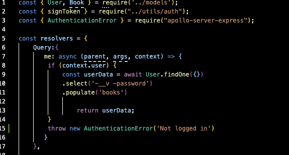
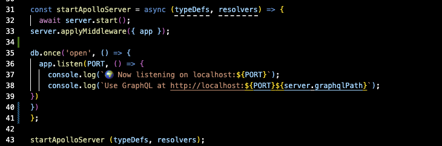
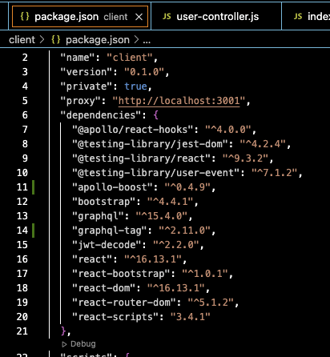

# book-search-engine

## Description

This Book Search Engine allows users to search a catalog of books and save them on the backend. We pull the book data from a Google API that was built GraphQL API and Apollo Server. While building this project I leaarned more aabout GraphQL and the integraation process. 

## Libraries Used
MongoDB
Node.js
Apollo Server
GraphQL
React
Express.js

## Code Snippet

## Author Links
<a href="https://github.com/Mrwaynejames">Github</a>